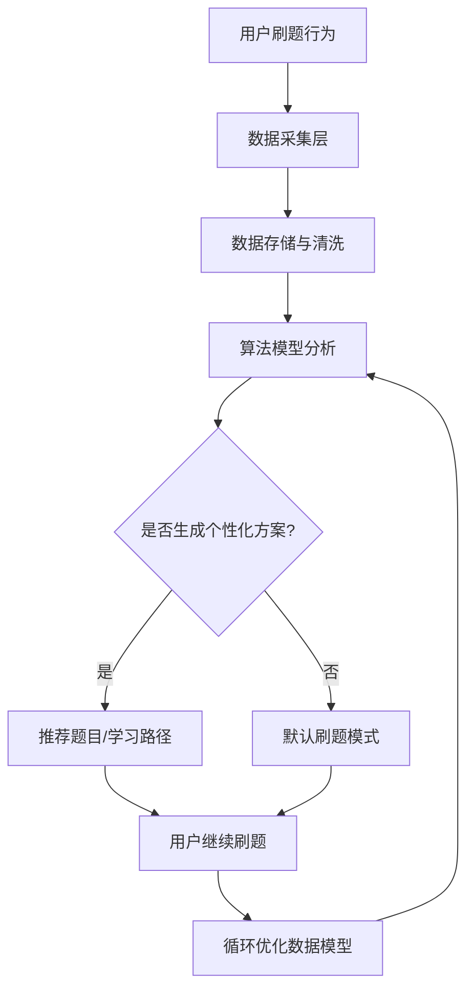

```mermaid
graph TD
    A[用户刷题行为] --> B[数据采集层]
    B --> C[数据存储与清洗]
    C --> D[算法模型分析]
    D --> E{是否生成个性化方案?}
    E -->|是| F[推荐题目/学习路径]
    E -->|否| G[默认刷题模式]
    F --> H[用户继续刷题]
    G --> H
    H --> I[循环优化数据模型]
    I --> D
```