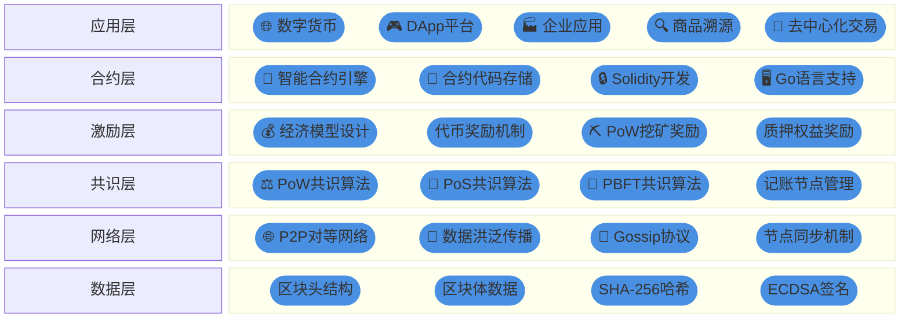

```mermaid
block-beta
    columns 2
    应用层
    block:group6:3  
        columns 5
        61(["🌐 数字货币"]) 62(["🎮 DApp平台"]) 63(["🏭 企业应用"])
        64(["🔍 商品溯源"]) 65(["💱 去中心化交易"])
    end
    合约层
    block:group5:3 
        columns 5
        51(["🤖 智能合约引擎"]) 52(["📜 合约代码存储"])
        53(["🔒 Solidity开发"]) 54(["🖥️ Go语言支持"])
    end
    激励层
    block:group4:3 
        columns 5
        41(["💰 经济模型设计"]) 42(["代币奖励机制"])
        43(["⛏️ PoW挖矿奖励"]) 44(["质押权益奖励"])
    end
    共识层
    block:group3:3 
        columns 5
        31(["⚖️ PoW共识算法"]) 32(["🌱 PoS共识算法"])
        33(["🤝 PBFT共识算法"]) 34(["记账节点管理"])
    end
    网络层
    block:group2:3 
        columns 5
        21(["🌐 P2P对等网络"]) 22(["📡 数据洪泛传播"])
        23(["👥 Gossip协议"]) 24(["节点同步机制"])
    end
    数据层
    block:group1:3 
        columns 5
        11(["区块头结构"]) 12(["区块体数据"])
        13(["SHA-256哈希"]) 14(["ECDSA签名"])
    end
    classDef blue fill:#4A90E2,color:white,stroke-width:0
    class 61,62,63,64,65,51,52,53,54,41,42,43,44,31,32,33,34,21,22,11,12,13,14,23,24 blue
```